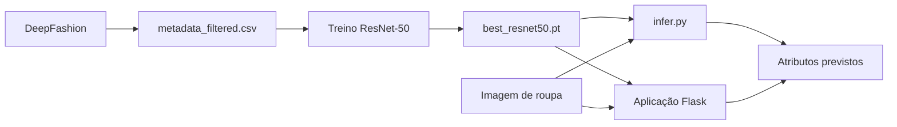

# Classificação de Atributos de Vestuário

## Grupo

**C27**

| Nome | Número | Email |
| --- | --- | --- |
| Filipa Calheiros | 31427 | filipacalheiros@ipvc.pt |
| Inês Delgado | 31414 | inesdelgado@ipvc.pt |

---

## 1. Introdução

Este projeto implementa um sistema de Visão por Computador para **classificação multi-rótulo de atributos de vestuário**. O objetivo é receber uma imagem de uma peça de roupa e prever vários atributos em simultâneo, como tipo de peça, padrão, material, corte, estilo ou outros detalhes visuais.

No comércio eletrónico, a etiquetagem manual de produtos é um processo demorado, sujeito a erros e muitas vezes inconsistente. Um sistema automático deste tipo pode ajudar a organizar catálogos, melhorar filtros de pesquisa e enriquecer bases de dados de produtos.

Ao contrário de uma classificação tradicional de rótulo único, esta tarefa é **multi-label**: uma só imagem pode ter vários atributos verdadeiros ao mesmo tempo. Por exemplo, uma blusa pode ser classificada como `long sleeve`, `chiffon`, `sheer`, `pleated` e `shirt`.

---

## 2. Objetivos

Os principais objetivos do projeto foram:

- preparar os dados do dataset DeepFashion para treino multi-label;
- selecionar um subconjunto de atributos relevantes;
- treinar um modelo de Deep Learning para prever esses atributos;
- avaliar o modelo com métricas adequadas;
- guardar o melhor checkpoint treinado;
- criar uma aplicação web simples para demonstrar a inferência;
- produzir materiais de apresentação com resultados, capturas de ecrã e vídeo.

---

## 3. Metodologia

A metodologia seguida foi organizada em cinco fases:

1. **Preparação dos dados:** conversão das anotações originais do DeepFashion para um ficheiro `metadata.csv`.
2. **Filtragem:** remoção de entradas cujo ficheiro de imagem não existia localmente.
3. **Treino:** adaptação de uma ResNet-50 pré-treinada para classificação multi-label.
4. **Inferência:** utilização do checkpoint treinado para prever atributos em imagens novas.
5. **Demonstração:** integração do modelo numa aplicação web Flask.

O treino foi realizado no Kaggle, usando GPU, porque o dataset é grande e o treino local seria mais demorado.

---

## 4. Ferramentas e Tecnologias

| Categoria | Tecnologia |
| --- | --- |
| Linguagem | Python 3.10+ |
| Deep Learning | PyTorch, Torchvision |
| Modelo | ResNet-50 multi-label |
| Dados | Pandas |
| Imagem | Pillow |
| Métricas | Scikit-learn |
| Interface web | Flask |
| Ambiente de treino | Kaggle com GPU Tesla T4 |
| Dataset | DeepFashion, subconjunto de previsão de atributos |

---

## 5. Dataset

O dataset utilizado foi o **DeepFashion**, mais especificamente o subconjunto com anotações de atributos de roupa. Cada imagem pode estar associada a vários atributos.

Foi usado um subconjunto de **50 atributos**, definido no ficheiro:

```text
data/selected_attributes.txt
```

Exemplos de atributos selecionados:

- `striped`
- `floral`
- `cotton`
- `denim`
- `long sleeve`
- `v-neck`
- `button`
- `red`
- `pink`

Durante a preparação no Kaggle, foram identificadas:

| Item | Valor |
| --- | ---: |
| Linhas originais no metadata | 289222 |
| Imagens existentes | 289147 |
| Imagens em falta | 75 |
| Atributos selecionados | 50 |

Após a filtragem foi criado o ficheiro:

```text
data/metadata_filtered.csv
```

Divisão final dos dados:

| Split | Número de imagens |
| --- | ---: |
| Train | 209169 |
| Val | 39990 |
| Test | 39988 |

---

## 6. Arquitetura do Sistema

A arquitetura geral do sistema é composta por:

1. dataset DeepFashion;
2. preparação e filtragem do metadata;
3. treino da ResNet-50;
4. geração do checkpoint `best_resnet50.pt`;
5. inferência por terminal;
6. aplicação web Flask.



---

## 7. Implementação

### 7.1 Preparação dos dados

O script responsável pela construção do metadata é:

```text
src/data/build_metadata.py
```

Este script lê os ficheiros originais do DeepFashion:

- `list_attr_img.txt`
- `list_attr_cloth.txt`
- `list_eval_partition.txt`

A partir destes ficheiros, gera uma tabela com:

- caminho da imagem;
- split (`train`, `val` ou `test`);
- número de atributos positivos;
- lista de atributos ativos;
- colunas binárias para cada atributo selecionado.

### 7.2 Dataset e transformações

O ficheiro:

```text
src/data/dataset.py
```

define a classe `DeepFashionMultiLabelDataset`, responsável por:

- ler o `metadata_filtered.csv`;
- abrir as imagens com Pillow;
- aplicar transformações;
- devolver a imagem e o vetor de atributos.

As imagens são redimensionadas para **224x224** e normalizadas com os valores médios e desvios-padrão do ImageNet. No treino são ainda aplicadas transformações simples de aumento de dados, como `RandomHorizontalFlip` e `ColorJitter`.

### 7.3 Modelo

O modelo encontra-se em:

```text
src/models/resnet_multilabel.py
```

Foi usada uma **ResNet-50 pré-treinada**. A camada final original foi substituída por:

- uma camada `Dropout`;
- uma camada `Linear` com uma saída por atributo.

Como a tarefa é multi-label, cada saída representa a probabilidade de um atributo estar presente na imagem.

### 7.4 Treino

O treino é realizado pelo script:

```text
src/train.py
```

Foram usados:

- modelo: ResNet-50;
- função de perda: `BCEWithLogitsLoss`;
- otimizador: `AdamW`;
- batch size: 32;
- tamanho da imagem: 224x224;
- épocas: 10;
- learning rate: `1e-4`.

A função `BCEWithLogitsLoss` é adequada porque cada atributo é tratado como uma decisão binária independente.

### 7.5 Inferência

O script:

```text
src/infer.py
```

permite carregar o checkpoint treinado e prever os atributos de uma imagem. As probabilidades são obtidas aplicando uma função sigmoide às saídas do modelo.

### 7.6 Aplicação web

A interface web está na pasta:

```text
frontend/
```

A aplicação foi desenvolvida em Flask e permite:

- carregar uma imagem;
- visualizar uma pré-visualização;
- ajustar o limite de confiança;
- executar a análise;
- ver os atributos previstos e respetivas probabilidades.

---

## 8. Resultados

O treino principal foi executado no Kaggle com GPU **Tesla T4**.

Parâmetros principais:

| Parâmetro | Valor |
| --- | --- |
| Modelo | ResNet-50 pré-treinada |
| Épocas | 10 |
| Batch size | 32 |
| Tamanho da imagem | 224x224 |
| Learning rate | 1e-4 |
| Max train batches | 3000 |
| Max val batches | 500 |

Evolução do treino:

| Época | Train loss | Val loss | F1 micro | F1 macro |
| ---: | ---: | ---: | ---: | ---: |
| 1 | 0.9530 | 0.8363 | 0.1646 | 0.1499 |
| 2 | 0.8313 | 0.8029 | 0.1840 | 0.1660 |
| 3 | 0.7847 | 0.7828 | 0.1944 | 0.1698 |
| 4 | 0.7507 | 0.7706 | 0.1940 | 0.1750 |
| 5 | 0.7154 | 0.7777 | 0.2088 | 0.1818 |
| 6 | 0.6900 | 0.7687 | 0.2151 | 0.1826 |
| 7 | 0.6637 | 0.7677 | 0.2153 | 0.1879 |
| 8 | 0.6357 | 0.7907 | 0.2180 | 0.1924 |
| 9 | 0.6115 | 0.8101 | 0.2294 | 0.1968 |
| 10 | 0.5921 | 0.8212 | 0.2290 | 0.2016 |

O melhor checkpoint foi guardado na época 10, por apresentar o melhor valor de **F1 macro**.

Métricas finais do checkpoint:

| Métrica | Valor |
| --- | ---: |
| Val loss | 0.8212 |
| F1 micro | 0.2290 |
| F1 macro | 0.2016 |

---

## 9. Teste de Inferência

Foi testada a inferência com uma imagem do DeepFashion:

```text
img/Sheer_Pleated-Front_Blouse/img_00000001.jpg
```

Top previsões:

| Atributo | Probabilidade |
| --- | ---: |
| long sleeve | 0.9823 |
| chiffon | 0.9495 |
| sleeve | 0.9318 |
| collar | 0.9117 |
| leather | 0.8161 |
| sheer | 0.7721 |
| pleated | 0.7463 |
| shirt | 0.6732 |
| woven | 0.6478 |
| faux leather | 0.6356 |

Este teste mostra que o modelo consegue devolver atributos visualmente relacionados com a peça analisada.

---

## 10. Demonstração da Aplicação

A aplicação web foi testada localmente depois de descarregar o checkpoint final do Kaggle.

O fluxo demonstrado foi:

1. abrir a aplicação Flask;
2. carregar uma imagem de vestuário;
3. ajustar o limite de confiança;
4. clicar em **Analisar imagem**;
5. visualizar os atributos previstos.

Foram produzidos prints e um vídeo curto do funcionamento da aplicação. Estes materiais estão na pasta `docs/` e são usados na apresentação.

---

## 11. Como Executar

### 11.1 Instalar dependências

```powershell
.\.venv\Scripts\python.exe -m pip install -r requirements.txt
```

### 11.2 Confirmar ficheiros necessários

Para testar localmente, devem existir:

```text
data/metadata_filtered.csv
outputs/checkpoints/best_resnet50.pt
```

O dataset e o modelo não são versionados no GitHub por serem ficheiros grandes.

### 11.3 Testar inferência por terminal

```powershell
.\.venv\Scripts\python.exe src\infer.py `
  --checkpoint outputs\checkpoints\best_resnet50.pt `
  --data-root data\deepfashion `
  --image img\Sheer_Pleated-Front_Blouse\img_00000001.jpg `
  --top-k 10
```

### 11.4 Executar a aplicação web

```powershell
.\.venv\Scripts\python.exe frontend\app.py
```

Depois abrir no browser:

```text
http://127.0.0.1:5000
```

---

## 12. Estrutura do Projeto

```text
.
+-- data/
|   +-- deepfashion/
|   +-- selected_attributes.txt
+-- docs/
|   +-- 2025-2026-AO-CP3-31414-31427.pptx
|   +-- video_fluxo_aplicacao.mp4
+-- frontend/
|   +-- app.py
|   +-- static/
|   +-- templates/
+-- notebooks/
|   +-- aoop-tp3.ipynb
+-- src/
|   +-- data/
|   +-- models/
|   +-- infer.py
|   +-- train.py
+-- requirements.txt
+-- README.md
```

---

## 13. Limitações

Apesar de o sistema estar funcional, existem algumas limitações:

- o F1 macro ainda é baixo para um cenário real;
- o treino foi limitado por `max-train-batches` e `max-val-batches`;
- foram usados apenas 50 atributos selecionados;
- algumas classes são visualmente subtis e desequilibradas;
- a qualidade da imagem influencia muito os resultados;
- foi implementada apenas a arquitetura ResNet-50.

---

## 14. Conclusão

O projeto permitiu construir uma pipeline completa para classificação multi-label de atributos de vestuário, desde a preparação dos dados até à demonstração numa aplicação web.

A abordagem multi-label é adequada ao problema, porque uma peça de roupa pode ter vários atributos em simultâneo. O modelo treinado conseguiu produzir previsões coerentes em exemplos de teste, embora os resultados mostrem que ainda existe margem para melhorar o desempenho.

Como trabalho futuro, seria relevante:

- treinar durante mais tempo ou com mais batches;
- ajustar thresholds por atributo;
- rever atributos raros ou muito desequilibrados;
- testar outras arquiteturas;
- avaliar com imagens externas;
- melhorar a interface e exportação dos resultados.

---

## 15. Artefactos de Entrega

Os principais artefactos de entrega são:

| Ficheiro | Descrição |
| --- | --- |
| `README.md` | Relatório principal e instruções de execução |
| `docs/2025-2026-AO-CP3-31414-31427.pptx` | Apresentação final |
| `docs/video_fluxo_aplicacao.mp4` | Vídeo de demonstração |
| `notebooks/aoop-tp3.ipynb` | Notebook usado no Kaggle |
